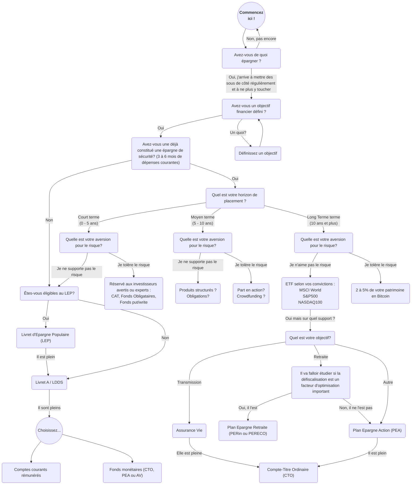

Ce diagramme est uniquement à titre informatif pour aider les néophytes à s'y retrouver. Les produits et placements discutés sont à destination de résidents fiscaux Français.
Il ne constitue en rien un conseil en investissement et reflète simplement l'avis d'amateurs éclairés.
Tout placement financier comporte des risques d'illiquidité, de pertes partielles ou totales.
Certaines analyses et avis se basent sur des performances passées. Elles ne garantissent en rien les performances futures.

